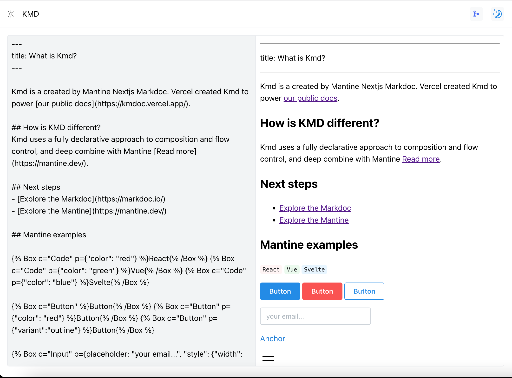
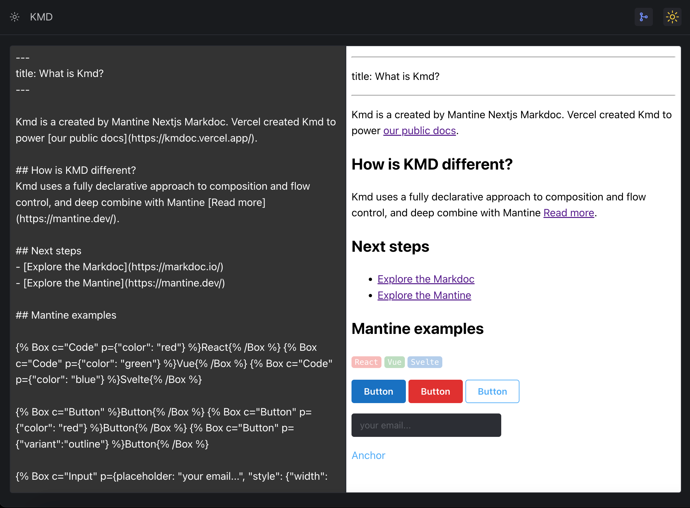

# KMD

A tiny WYSIWYG for markdown. Tech's: `Mantine` `Nextjs` `Markdoc`

## Features

  Kmd uses a fully declarative approach to composition and flow control, and deep combine with Mantine [Read more](https://mantine.dev/).

## Site

[Quick look](https://kmdoc.vercel.app)

## Screen Shot

> Light Mode

> Dark Mode

